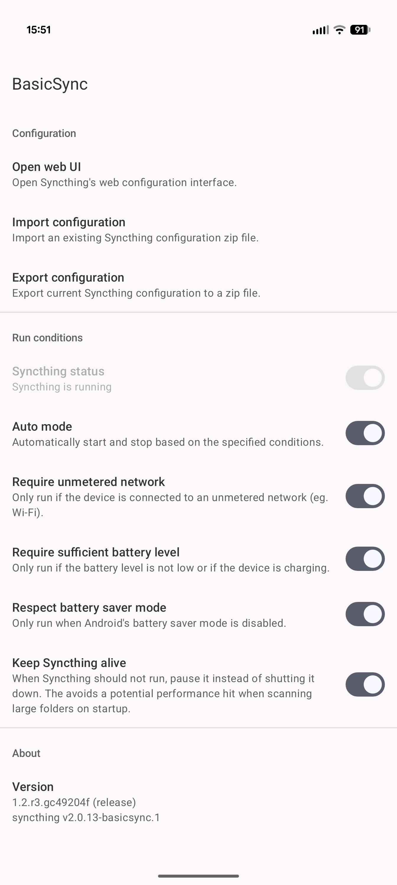
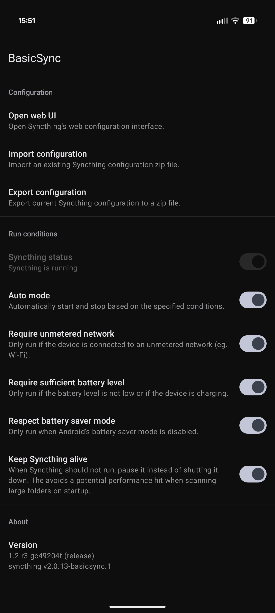

# BasicSync


BasicSync is a simple app for running Syncthing on Android.

The app is intentionally kept very basic so that the project is easy to maintain and keep updated. BasicSync only controls when Syncthing runs. The actual configuration is done through Syncthing's own web UI.

 

## Features

* Supports Android 9 and newer
* Supports importing and exporting the configuration
* Supports pausing syncing based on network and battery conditions
* Supports Android's HTTP proxy settings
* Runs Syncthing as a library in the main process
    * This makes BasicSync immune to Android >=12's child process restrictions
* Small additions to Syncthing's web UI to add a folder picker and QR code scanner

## Limitations

* Android's Storage Access Framework is not supported. While, with effort, it's possible to implement a custom filesystem backend for Syncthing, SAF is not well suited for Syncthing's file access patterns.

    * Accessing files by path is extremely expensive. For example, accessing `a/b/c` requires `stat`ing every file in directories `a` and `b`. This is unavoidable without caching.
    * Syncthing is much more efficient when it can monitor for changes with inotify-style watchers. While it is technically possible to monitor for changes to directories with SAF, it does not report what changed. Computing the changes is an expensive operation. SAF also does not support watching files, only directories.
    * Creating and opening files are two separate operations, which can result in concurrency issues and file conflicts. Furthermore, attempting to create a file that already exists results in Android creating a new file with a numbered suffix instead of returning an error.

## Usage

1. Download the latest version from the [releases page](https://github.com/chenxiaolong/BasicSync/releases). To verify the digital signature, see the [verifying digital signatures](#verifying-digital-signatures) section.

2. Grant the required permissions and set the desired run conditions.

3. That's it! Open the Syncthing web UI to configure it as would be done on a computer.

    By default, BasicSync runs in automatic mode where it starts and stops Syncthing based on the specified run conditions. However, this can be overridden by selecting "Manual mode" in BasicSync's notification, which allows manually controlling when Syncthing runs.

## Permissions

* `FOREGROUND_SERVICE`, `FOREGROUND_SERVICE_SPECIAL_USE` (Android >=14)
    * Needed to run Syncthing in the background indefinitely.
* `POST_NOTIFICATIONS`
    * Needed to run Syncthing in the background and also to manually start and stop Syncthing if desired.
* `INTERNET`
    * Only used to allow Syncthing to connect to the network.
    * BasicSync does not and will never have ads or telemetry of its own.
    * Syncthing has opt-in telemetry and asks for approval before any data it sent.
    * Syncthing's crash reporting is disabled because BasicSync integrates it in a way that is not supported upstream.
* `ACCESS_NETWORK_STATE`
    * Used for detecting when the device is connected to the network and if the network is unmetered.
* `MANAGE_EXTERNAL_STORAGE` (Android >=11), `READ_EXTERNAL_STORAGE`/`WRITE_EXTERNAL_STORAGE` (Android <11)
    * Needed for Syncthing to access files on the internal storage (`/sdcard`).
* `RECEIVE_BOOT_COMPLETED`
    * Needed for automatically starting Syncthing after a reboot.
* `REQUEST_IGNORE_BATTERY_OPTIMIZATIONS`
    * Needed to allow asking for permission to disable battery optimizations.
* `CAMERA`
    * Optionally used for scanning a device's QR code when adding a new device.

## Remote access

Syncthing listens on the loopback interface and is available via `localhost` (both IPv4 `127.0.0.1` and IPv6 `::1`). BasicSync will try to use the same port on every start (with a default of 8384), but will automatically pick a new random port if there is a conflict. The current port number can be found in Web UI -> Actions -> Settings -> GUI. HTTPS and basic authentication are both forcibly enabled every time Syncthing starts.

For basic authentication, the password is the API token. Generating new API tokens is supported, but setting an arbitrary password is not. BasicSync will internally set the password to the API token on every start.

## Verifying digital signatures

First, use `apksigner` to print the digests of the APK signing certificate:

```
apksigner verify --print-certs BasicSync-<version>-<arch>-release.apk
```

Then, check that the SHA-256 digest of the APK signing certificate is:

```
08f8267bbd8827eaafc6f43294e5fb13e8e36e0bb2af2648d4e7b906cae713fa
```

## Building from source

Before building, the following tools must be installed:

* Android SDK
* Android NDK
* `go` (golang compiler)
  * We use a fork of golang that includes a fix for MTE-related crashes. However, an existing golang compiler must still be installed in order to build the fork from source.
    * https://github.com/golang/go/issues/27610
    * https://github.com/golang/go/issues/59090

Once the dependencies are installed, BasicSync can be built like most other Android apps using Android Studio or the gradle command line.

To build the APK:

```bash
./gradlew assembleDebug
```

The APK will be signed with the default autogenerated debug key.

To create a release build with a specific signing key, set the following environment variables:

```bash
export RELEASE_KEYSTORE=/path/to/keystore.jks
export RELEASE_KEY_ALIAS=alias_name

read -r -s RELEASE_KEYSTORE_PASSPHRASE
read -r -s RELEASE_KEY_PASSPHRASE
export RELEASE_KEYSTORE_PASSPHRASE
export RELEASE_KEY_PASSPHRASE
```

and then build the release APK:

```bash
./gradlew assembleRelease
```

### Android Studio

When loading the project in Android Studio, it might be necessary to build stbridge once first:

```bash
./gradlew stbridge
```

Even though AGP (Android Gradle Plugin) is set up so that `stbridge` is a `preBuild` dependency of all Android-related components, Android Studio seems to have trouble syncing the gradle project if stbridge's `.aar` file doesn't exist yet. There is no issue when building on the command line.

## Contributing

Bug fix and translation pull requests are welcome and much appreciated!

If you are interested in implementing a new feature and would like to see it included in BasicSync, please open an issue to discuss it first. This is a side project that I work on for fun, so I'm hesitant to add features I won't personally use. I intend for BasicSync to be as simple and low-maintenance as possible.

## License

BasicSync itself is licensed under GPLv3. Please see [`LICENSE`](./LICENSE) for the full license text.

The bundled Syncthing, along with the additional patches applied in [BasicSync's fork](https://github.com/chenxiaolong/syncthing), is [licensed under MPL 2.0](https://github.com/syncthing/syncthing/blob/main/LICENSE).
